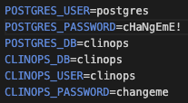

# Abstract #

CDISC 360i defines a vision and roadmap to enable standards-driven automation across the clinical research data life cycle - from study design to analysis. The purpose of these notebooks is to demonstrate the 360i Technical Roadmap by showcasing a strategy for research data pipeline automation using end-to-end, machine-readable standards metadata.

These notebooks automate study design using concepts and a standardized model to build a digital protocol. Aligned Case Report Forms (CRFs) and SDTM resources will be automatically generated as downstream artifacts using metadata from the digital protocol.

# Notebooks #
## Dockerized Notebook

This environment exists as two Docker containers; one hosting a PostgreSQL relational database and the other, the Jupyter notebook environment.

### How-to

#### Setup Environment

1. Navigate to https://github.com/git-guides/install-git to install the latest git distribution for your platform.
2. Navigate to https://www.docker.com/ to Download Docker Desktop.  This will include all binaries that are required to run Docker containers on your chosen platform.
3. Start Docker Desktop on your platfrom.
4. Clone this repository to the desired directory.

#### Use notebook

1. Change into the root of the cloned directory.
2. In the root of the cloned repository, create a .env text file.
3. Enter the following in .env:

    

4. Enter custom values for the environmental variables and save the file changes.
5. Execute `source initial-startup.sh`
6. Open a browser to http://localhost:8888
7. Navigate to the notebooks directory and open the *CDISC_360i_Jupyter_Protocol_to_Submission.ipynb* notebook.

All CDISC utilities as well as the resources will be created in the notebooks directory in the *clinical-notebook* container.

All tables will be created in the PostgreSQL database in the *clinical-database* container.

# Resources #
**Other GitHub projects used in the notebooks**

|Project                            |GitHub Repository                                                                          |
|-----------------------------------|-------------------------------------------------------------------------------------------|
|Study Definition Workbench         |https://github.com/data4knowledge/study_definitions_workbench                              |
|Open Study Builder                 |https://gitlab.com/Novo-Nordisk/nn-public/openstudybuilder/OpenStudyBuilder-Solution       |
|Study USDM documents               |https://github.com/cdisc-org/360i/tree/main/data/protocol/LZZT/usdm                        |
|USDM validation utility            |https://github.com/pendingintent/cdisc-json-validation                                     |
|CDISC CORE Rules Engine            |https://github.com/cdisc-org/cdisc-rules-engine                                            |
|CRF creation                       |https://github.com/lexjansen/cdisc360i-pocs                                                |
|Trial Design Dataset creation      |https://github.com/pendingintent/cdisc-usdm-utils                                          |
|Define-XML template creation       |https://github.com/dostiep/360i                                                            |
|Define-XML creation                |https://github.com/swhume/template2define                                                  |
|Raw subject data                   |https://github.com/alidootson/UpdatedCDISCPilotData/tree/main/UpdatedCDISCPilotData/CDASH  |